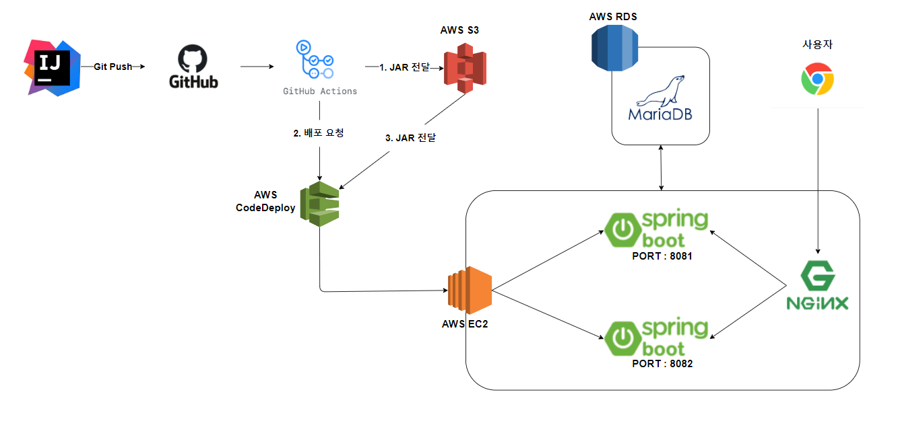
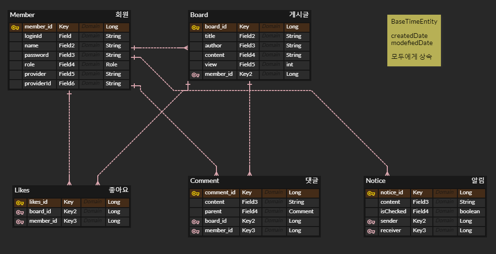

# 게시판 프로젝트
http://ec2-3-39-198-18.ap-northeast-2.compute.amazonaws.com/
## 개발 환경
- IntelliJ
- Github

## 사용기술
#### 백엔드
- SpringBoot
- SpringBootSecurity
- Spring Data JPA
- QueryDSL

#### Build tool
- Gradle

#### Database
- MariaDB

#### Infra
- AWS EC2
- AWS S3
- Github Actions
- AWS CodeDeploy

#### 프론트엔드
- JavaScript
- Html/Css
- Thymeleaf
- BootStrap
- ToastUIEditor

## 시스템 아키텍처

## ERD

## 기능
- 스프링 시큐리티를 이용한 회원가입 로그인
- Oauth를 이용한 구글 로그인
- 게시판 CRUD
- 로그인 실패시 에러처리
- 계층형 대댓글
- 좋아요 기능
- 쿠키를 이용한 조회수 중복 방지 기능
- 나에게 댓글이나 좋아요를 하면 알림이 오는 기능
- Toast UI Editor를 이용한 게시글 작성
- Toast UI에 이미지를 삽입시 ajax를 통해 aws s3로 업로드 후 업로드된 url을 반환
- 페이징 기능
- Querydsl을 이용한 동적 검색
- 마이페이지(내가 쓴 게시글, 댓글)/프로필 수정
- Github Actions와 AWS CodeDeploy를 이용한 CI/CD 무중단 배포

## 트러블 슈팅
### JPA N+1문제 해결해보기
https://velog.io/@thwn40/asdf-0ljqxt9s

## 느낀점
인프런에서 강의를 듣고 스프링 기본기를 더욱 튼튼하게 잡고 실력을 확인해보기 위해 백엔드의 제일 기본이
되는 게시판을 만들어보았습니다 .개인적으로 게시판에 진짜 이건 있어야겠다라고 느낄만한 기능들은 모두 넣으려고
노력했고 기능을 넣다보니 자연스럽게 몰랐던 개념들도 알아서 역시 직접 만들어봐야 실력이 많이 느는구나 라는걸 느꼈고
처음 만들땐 진짜 막막했던것도 계속 고민하면서 결국 해결하는 제 모습을 보고 역시 하면 되네 하고 자신감을 많이 얻었던거
같습니다.
